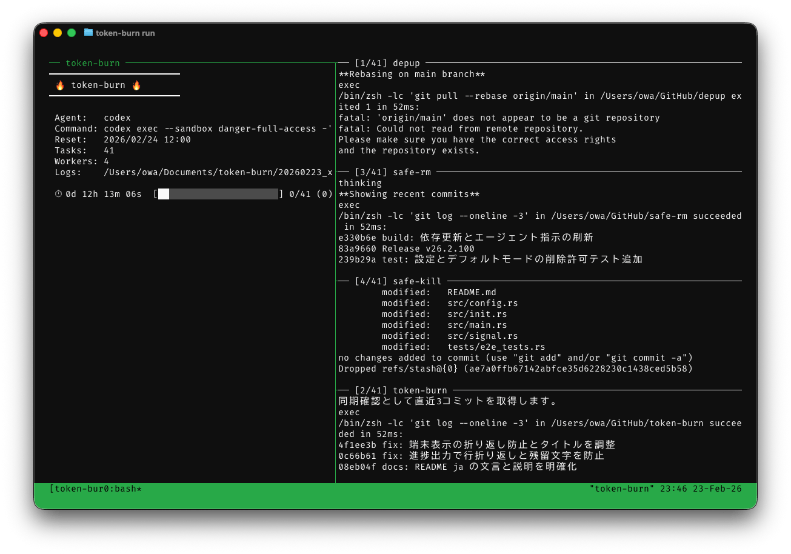
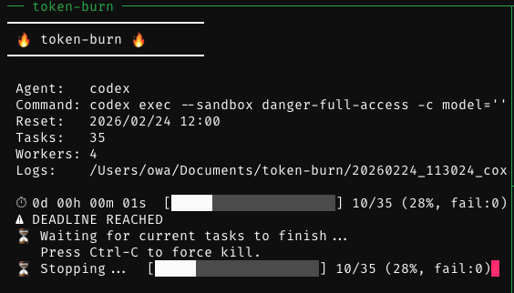

<p align="center">
  
</p>

<h1 align="center">token-burn</h1>

<p align="center">
  <strong>週次リセット前にAIコーディングアシスタントのトークンを消費するCLIツール</strong>
</p>

<p align="center">
  <a href="https://github.com/owayo/token-burn/actions/workflows/ci.yml">
    
  </a>
  <a href="https://github.com/owayo/token-burn/releases/latest">
    
  </a>
  <a href="LICENSE">
    
  </a>
</p>

<p align="center">
  <a href="README.md">English</a> | 日本語
</p>

---

## 概要

Claude Code / Codex CLI のトークンは週次でリセットされますが、未使用分は繰り越されません。「もったいない」精神で、**token-burn** はリセット直前の残りトークンを有効活用します。コードレビュー、バグ修正、リファクタリング、テスト改善など、自由に定義したプロンプトをリポジトリ群に対して並列実行します。リセット時刻が来ると、新規タスクの開始を止め、実行中のタスクが完了するまで待機します。

<p align="center">
  
</p>

<p align="center">
  
</p>

## 特徴

- **自動探索**: ディレクトリをスキャンしてGitリポジトリを検出、remote URLのユーザー名でフィルタ
- **複数スキャンソース**: GitHub用、GitLab用など、スキャン設定を複数定義可能
- **重複スキャン対策**: 複数スキャンソースで同じディレクトリが見つかっても1回だけ処理
- **可視性対応**: 公開リポジトリを優先的に処理（remote のリポジトリ名で照合）
- **マルチエージェント**: Claude Code、Codex CLI、カスタムエージェントに対応
- **スマートスケジューリング**: リセット期限が最も近いエージェントを自動選択
- **ai-usage 連携**: 外部ツール `ai-usage --json` から各エージェントの reset 時刻を実データ（`weekly.resets_at`）で取得し、曜日固定計算に頼らずスケジュールを自動更新（解決失敗時は曜日計算へフォールバック可能）
- **アカウント別展開**: 1 エージェントを複数プロファイル（例: `work` / `home`）へ展開し、それぞれ専用の env（`CLAUDE_CONFIG_DIR` 等）で起動。`state.json` のキーも `<agent>-<profile>` で分離されアカウントごとに処理済み状態を管理
- **デッドライン制御**: リセット時刻到達時に新規タスクの開始を止め、実行中タスクの完了を待機
- **並列実行**: tmuxペイン分割とプログレスモニター付きで複数プロンプトを同時実行
- **tmux デタッチ安全性**: デタッチ時はワーカースクリプトとキューを保持し、tmux セッション終了までバックグラウンドタスクを安全に継続
- **Claude の無人実行**: Claude Code の `AskUserQuestion` ツールを自動禁止し、token-burn ジョブが対話回答待ちで停止しないようにする
- **サブエージェント監視**: Claude Codeのチーム/エージェントタスクの開始・進捗・状態更新・完了をリアルタイム表示
- **システム通知の可視化**: stop hook エラーなどの Claude Code システム通知に加え、`hook_progress` / `hook_response` に stderr や output が含まれる場合のフック診断も表示
- **ツール詳細の強化**: Claude の stream-json に含まれる `Read` の offset/limit/view range と malformed 入力長、`Edit` の一括置換状態、`Bash` の timeout/background/sandbox 無効化状態、`Agent` のバックグラウンド状態、`Grep`/`Glob` の output mode・type・ignore-case・only-matching・multiline・glob・head/context/offset 制限、`ScheduleWakeup` の待機時間/理由、`WebFetch` の URL とプロンプト要約、`WebSearch` のクエリと include/exclude ドメイン件数、`ToolSearch` のクエリと `max_results`、`Monitor` の説明/タイムアウト/condition/persistent 状態、`TaskStop` の task id（複数指定含む）と理由、`TaskList` 呼び出し、`TaskGet` の task id、`TaskOutput` の task id / `block` / `timeout`、`TaskCreate` の `subject` / `description` / `activeForm`、`TaskUpdate` の `taskId` / `status` / `owner` / `subject` / `description`、`SendMessage` の要約、既存ログなどに含まれる `AskUserQuestion` の質問/選択肢、Tavily/Codex MCP の model/sandbox/approval 詳細、Context7 MCP ツールの library/query を表示
- **サブエージェント停止の可視化**: `task_notification` の `status="stopped"`（`TaskStop` 等で停止された場合）もモニターに表示。`usage` が無い通知では duration/token を 0 として表示しない
- **ツールエラー要約**: `tool_result` の `is_error:true` を検出すると、エラー内容の先頭の有意な 1 行を 120 文字までに省略してモニターに併記（単一行/複数行の `<tool_use_error>` ラッパーは除去）。jsonl を開かずに失敗の原因が分かる
- **ツール結果メタデータ**: top-level `tool_use_result` に含まれる出力切り詰め、適用 limit、stale read ヒント、Edit/Write が書き込み前にユーザによる変更を検出した場合の `user-modified` マーカー、失敗理由（`error:` / `message:`）、MCP/Codex の構造化応答要約（`structured:`）、自動バックグラウンド化、待機時間の clamp、永続化出力サイズ、戻りコード解釈、Agent の duration/token/tool 数・サブエージェント種別（`agent:`）・解決モデル（`model:`）・サブエージェントの編集行数（`edits:+追加/-削除`）、Grep/ToolSearch の結果件数と mode、WebSearch の結果件数/検索回数/所要時間、WebFetch の HTTP ステータスコードと応答サイズ（`http:200 OK`、`bytes:120.2KB`）、Read の部分読み取り行数（`lines:<n>/<total>`）と token cap 切り詰め（`truncated:token-cap`）、git commit 操作（sha/kind）、タスク件数/task id/task type、TaskOutput の取得状態、読み取り可能な Agent 出力ファイル、Monitor の timeout/persistent 状態、TaskUpdate の状態遷移と status 以外の変更フィールド（`updated:<field1>,<field2>`）、async Agent 起動（`run_in_background=true` 時に `async`）、ScheduleWakeup の予定時刻、Skill のコマンド名と許可ツール件数（`allowed-tools:<n>`）などの重要情報を表示
- **ログパイプラインの安全性**: `format-stream`、`tee`、raw jsonl 保存に失敗したタスクを完了扱いにせず失敗として記録
- **モデル別使用量**: 結果サマリーにモデルごと（Opus、Haiku等）のトークン使用量・コスト・キャッシュ読み取り/書き込み・Web検索回数、そして各モデルのコンテキスト上限/最大出力上限（例: `ctx:1M` / `max_out:64K`）を表示
- **API応答時間**: 実行時間に加えてAPI応答時間・初回トークン到達時間（`ttft`）・初回ストリームトークン到達時間（`stream:`。キュー/リトライ待ちを除いた純粋なストリーム遅延）・リクエスト送信までの所要時間（`req:<n>ms`）を表示
- **fast mode 表示**: fast mode が有効な場合にその状態を表示
- **terminal_reason / permission_denials**: 異常終了時の `terminal_reason`（`completed` 以外）と権限拒否されたツール呼び出しの件数/ツール名を結果サマリーに表示
- **結果メタデータ**: `usage.service_tier`、`usage.speed`、空でない推論リージョン、iteration 数、result origin 種別を表示
- **レート制限通知**: 使用率の警告、リクエスト拒否、`allowed` 時のリセット時刻/overageリセット補足情報、および `allowed_warning` でサーバー側が通過した警告閾値（例: `warning at 90%`）を表示し、ローカル閾値超過時に後続タスクを自動停止
- **ai-usage 使用率ゲート**: ai-usage 連携時、各タスク完了後に該当 agent の実使用率（weekly / five_hour の最大）を確認し、`rate_limit_threshold` 以上なら後続タスクを停止。stream-json のリアルタイム監視が無い codex でも実使用率で確実に停止でき、取得失敗時は fail-closed で安全側に倒す
- **モニター使用量パネル**: ai-usage 連携時、tmux モニターペインに `ai-usage --statusline --logos`（各アカウントの 5h / 週次使用率バー）を 10 秒ごとに表示（`--input` でキャッシュから高速描画、進捗バーは毎秒更新）
- **APIリトライ表示**: 一時的な障害時のリトライ試行回数とエラー情報を表示
- **ログ衝突回避**: タスクごとのログに連番を付け、同名リポジトリでも上書きしない
- **プロンプトファイル**: `.md` ファイルまたはインライン文字列でプロンプトを指定可能
- **レジューム**: 処理済みディレクトリを自動スキップ、スキップ期間を設定可能
- **状態更新の競合対策**: 並列ワーカーが安定した sidecar lock file の下で `state.json` を atomic rename 更新
- **ドライラン**: コマンドを実行せずに実行計画をプレビュー

## 動作環境

- **OS**: macOS
- **tmux**: ペイン分割実行に必要
- **Rust**: 1.85以上（ソースからビルドする場合）
- **gh CLI**: リポジトリ可視性の検出に必要
- **Claude Code** および/または **Codex CLI**: 少なくとも1つのエージェントが必要

## インストール

### Homebrew (macOS/Linux)

```bash
brew install owayo/token-burn/token-burn
```

### ソースからビルド

```bash
git clone https://github.com/owayo/token-burn.git
cd token-burn
make install
```

### バイナリダウンロード

[Releases](https://github.com/owayo/token-burn/releases) から最新バイナリをダウンロード。

#### macOS (Apple Silicon)

```bash
curl -L https://github.com/owayo/token-burn/releases/latest/download/token-burn-aarch64-apple-darwin.tar.gz | tar xz
sudo mv token-burn /usr/local/bin/
```

#### macOS (Intel)

```bash
curl -L https://github.com/owayo/token-burn/releases/latest/download/token-burn-x86_64-apple-darwin.tar.gz | tar xz
sudo mv token-burn /usr/local/bin/
```

## 使い方

### クイックスタート

```bash
# 設定ファイルとデフォルトプロンプトを生成
token-burn init

# エージェントのリセット状況を確認
token-burn status

# 実行計画のプレビュー
token-burn run -n

# 特定のリポジトリだけを強制実行
token-burn run ~/GitHub/repo-a ./repo-b

# トークン消費を実行
token-burn run
```

### コマンド

| コマンド | 説明 |
|---------|------|
| `run` | トークン消費を実行（デフォルト） |
| `status` | エージェントのリセット状況を表示 |
| `init` | 設定ファイルとプロンプトテンプレートを生成 |
| `clean` | 古いレポートディレクトリを削除 |

### オプション

| オプション | 短縮形 | 説明 |
|-----------|-------|------|
| `--config <PATH>` | `-c` | 設定ファイルパス（デフォルト: `~/.config/token-burn/config.toml`） |
| `--agent <NAME>` | | エージェントを強制指定 |
| `--dry-run` | `-n` | 実行せずにプレビュー |
| `--fresh` | | 保存済み状態を無視して全ターゲットを処理 |
| `--limit <N>` | `-l` | 処理するターゲット数の上限（`N >= 1`） |
| `--no-limit` | | 上限なしですべてのターゲットを処理 |
| `--public-only` | | 公開リポジトリとして判定されたもののみ処理 |
| `--help` | `-h` | ヘルプ表示 |
| `--version` | `-V` | バージョン表示 |

`init` は `--force`（`-f`）で既存ファイルを確認なしで上書きできます。

`clean` は `--older-than` で `cleanup_after` の設定値を一時的に変更できます（例: `--older-than 3d`）。

`run` に `PATH` を1つ以上渡した場合、そのディレクトリ群に対して強制実行され、スキャン結果と状態ベースのスキップは使いません。`repo` と `./repo` のような等価なパスは正規化後に重複排除されるため、1回の実行で同じディレクトリが二重実行されることはありません。

## 設定

デフォルトの設定ファイルパス: `~/.config/token-burn/config.toml`

`token-burn init` で設定テンプレートを生成してください。

### 基本設定

```toml
[settings]
parallelism = 3
skip_within = "7d"    # 任意
```

| フィールド | 説明 | 例 |
|-----------|------|-----|
| `parallelism` | 並列実行数 | `3` |
| `skip_within` | この期間以内に処理済みならスキップ | `"7d"`, `"24h"`, `"1d12h"` |
| `cleanup_after` | この期間より古いレポートディレクトリを自動削除 | `"7d"`（デフォルト） |
| `report_dir` | 実行ログの保存先ディレクトリ | `~/Documents/token-burn`（デフォルト） |
| `limit` | 1回の実行で処理する最大ターゲット数（`>= 1`） | `10`（デフォルト） |
| `rate_limit_threshold` | レート制限使用率がこの閾値（%）以上で自動停止（`1-100`）。Claude の stream-json リアルタイム監視に加え、ai-usage 連携時は各タスク完了後にも該当 agent の実使用率（weekly / five_hour の最大）でチェックされる | `95`（デフォルト） |

`skip_within` と `cleanup_after` には、`d`（日）、`h`（時間）、`m`（分）、`s`（秒）を使った期間文字列を指定します。不正な値は設定ファイルの読み込み時点でエラーになります。`skip_within` を省略した場合は前回リセット以降に処理済みのターゲットをスキップします。過大な値もエラーになります。`--fresh` を指定すると保存済み状態を無視して全ターゲットを処理します。

状態ファイル: `<config-dir>/state.json`（有効な設定ファイルと同じディレクトリ）。更新時は同一ディレクトリのテンポラリファイルへ書き出してから `rename` で atomic に差し替え、`.state.json.lock` のような安定した sidecar lock file で並列ワーカーを直列化します。デフォルト設定パスの場合は `~/.config/token-burn/state.json`。

### エージェント

```toml
[[agents]]
name = "claude"
command = ["claude", "--dangerously-skip-permissions", "--model", "opus"]
reset_weekday = "monday"
reset_time = "09:00"
timezone = "Asia/Tokyo"
prompt = "prompts/test-coverage.md"  # 任意

[[agents]]
name = "codex"
command = ["codex", "exec", "--full-auto", "-c", "model='gpt-5.3-codex'", "-c", "model_reasoning_effort='xhigh'"]
reset_weekday = "thursday"
reset_time = "09:00"
timezone = "Asia/Tokyo"
# prompt = "prompts/codex.md"
```

| フィールド | 説明 | 例 |
|-----------|------|-----|
| `name` | エージェント識別名 | `"claude"` |
| `provider` | プロバイダ識別子。`ai-usage` の `(profile, provider)` 照合に使用（ai-usage 連携時は必須） | `"claude"` |
| `command` | コマンドと引数 | `["claude"]` |
| `env` | 起動時に付与する環境変数（任意）。プロファイル側の `env` で上書きマージされる | `{ FOO = "bar" }` |
| `reset_weekday` | リセット曜日 | `"monday"` |
| `reset_time` | リセット時刻（HH:MM） | `"09:00"` |
| `timezone` | IANAタイムゾーン | `"Asia/Tokyo"` |
| `prompt` | エージェント固有プロンプト（任意） | `"prompts/test-coverage.md"` |

`name` は空文字不可です。`command` は1要素以上を指定し、先頭要素には空でない実行ファイル名を指定してください。`prompt` を指定するとグローバルの `[prompts].default` の代わりに使われます。ターゲット固有の `prompt` が最優先です。

`reset_weekday` / `reset_time` / `timezone` は通常は必須ですが、ai-usage 連携（[ai-usage 連携](#ai-usage-連携任意)を参照）を有効化しており、かつ `fallback` が `fixed` 以外の場合のみ `reset_weekday` を省略できます。省略時は ai-usage が解決できなかったときの曜日計算フォールバックが利用できなくなる点に注意してください。`env` のキーは `[A-Za-z_][A-Za-z0-9_]*` に制限され、値は `~`（ホームディレクトリ）が展開されます。

**プロンプト優先順位**: `[[targets]].prompt` > `[[agents]].prompt` > `[prompts].default`

**Claude 必須フラグの自動付与**: コマンドの実行ファイルが `claude` の場合、ログ出力と進捗モニタリングに必要な `-p`、`--verbose`、`--output-format stream-json`、`--include-partial-messages` と、対話回答待ちを防ぐ `--disallowedTools=AskUserQuestion` が必ず有効化されます。未指定フラグは自動追加され、既存の `--output-format` 値（`--output-format=...` 形式を含む）は `stream-json` に正規化されます。既存の `--disallowedTools` / `--disallowed-tools` がある場合は、必要に応じて equals 形式へ正規化して `AskUserQuestion` を追記します。設定ファイルへの記述は不要です。

`reset_weekday` に指定可能な値: `monday` `tuesday` `wednesday` `thursday` `friday` `saturday` `sunday`（短縮形: `mon` `tue` `wed` `thu` `fri` `sat` `sun`）

### ai-usage 連携（任意）

外部ツール `ai-usage --json` と連携すると、各エージェントの reset 時刻を実データ（`weekly.resets_at`）から自動取得できます。従来は `reset_weekday` / `reset_time` / `timezone` から固定計算していましたが、ai-usage 連携を有効化すると実際の利用状況に基づいた reset 時刻が使われます（固定計算は解決失敗時のフォールバックとして引き続き機能します）。

連携が無い、または `enabled = false` の場合は従来どおり曜日計算のみで動作します。

```toml
[ai_usage]                 # 任意。無い or enabled=false なら従来の曜日計算のみ
enabled = true
command = ["ai-usage", "--json"]   # デフォルト
window = "weekly"          # weekly | five_hour | nearest（deadline 算出枠、デフォルト weekly）
fallback = "fixed"         # fixed | skip | error（解決失敗時、デフォルト fixed）
state_window = "weekly"    # weekly | selected（処理済みカットオフ枠、デフォルト weekly）

[[ai_usage.profiles]]
name = "work"              # 内部参照名（展開名 <agent>-<name> に使う）
profile = "Work"           # ai-usage --json の "profile" と照合（大文字小文字を区別）
env = { CLAUDE_CONFIG_DIR = "~/.config/claude-work" }  # そのアカウントでの起動時 env（~ 展開される）

[[ai_usage.profiles]]
name = "home"
profile = "Home"
env = { CLAUDE_CONFIG_DIR = "~/.config/claude-home" }

[[agents]]
name = "claude"
provider = "claude"        # ai-usage の (profile, provider) 照合に使用。ai_usage 連携時は必須
command = ["claude"]
# env = { ... }            # 任意。profile.env で上書きマージされる
reset_weekday = "monday"   # ai_usage 連携かつ fallback != fixed のときは省略可。それ以外は必須
reset_time = "09:00"
timezone = "Asia/Tokyo"
[agents.ai_usage]
profiles = ["work", "home"]    # 参照する profile 名。複数指定でアカウント別に展開
# window = "weekly"            # 任意: グローバル設定の上書き
# fallback = "fixed"           # 任意: グローバル設定の上書き
```

#### `[ai_usage]`（グローバル設定）

| フィールド | 説明 | デフォルト |
|-----------|------|-----------|
| `enabled` | ai-usage 連携を有効化する。無い or `false` なら従来の曜日計算のみ | `false` |
| `command` | 実行する ai-usage コマンドと引数 | `["ai-usage", "--json"]` |
| `window` | deadline 算出に使う枠。`weekly` / `five_hour` / `nearest` | `"weekly"` |
| `fallback` | 解決失敗時の挙動。`fixed`（曜日計算へフォールバック）/ `skip`（候補から除外）/ `error`（停止） | `"fixed"` |
| `state_window` | 処理済みカットオフの算出枠。`weekly` / `selected` | `"weekly"` |

#### `[[ai_usage.profiles]]`（プロファイル定義）

| フィールド | 説明 | 例 |
|-----------|------|-----|
| `name` | 内部参照名。エージェントの展開名 `<agent>-<name>` に使われる | `"work"` |
| `profile` | `ai-usage --json` の `"profile"` と照合する名前（大文字小文字を区別） | `"Work"` |
| `env` | そのアカウントでの起動時 env（任意）。キーは `[A-Za-z_][A-Za-z0-9_]*`、値は `~` 展開される | `{ CLAUDE_CONFIG_DIR = "~/.config/claude-work" }` |

#### `[agents.ai_usage]`（エージェント側の連携設定）

| フィールド | 説明 | 例 |
|-----------|------|-----|
| `profiles` | 参照する profile 名のリスト。複数指定でアカウント別に展開 | `["work", "home"]` |
| `window` | グローバル `window` の上書き（任意） | `"weekly"` |
| `fallback` | グローバル `fallback` の上書き（任意） | `"fixed"` |

#### 挙動

- 実行時に agent × profile を展開します。例: `claude` + `["work", "home"]` → `claude-work` / `claude-home` の 2 エージェント。各々プロファイルの `env` を付与して起動します。**profile を 1 つだけ参照する場合は展開名が agent 名のまま**（例: `codex` が `["home"]` のみ → `codex`）で、サフィックス `<agent>-<profile>` が付くのは 2 つ以上参照したときだけです。起動コマンドが異なる各アカウントを別 agent として定義しても展開名が冗長にならず、`state.json` キーも安定します。
- 展開名は `state.json` のキーにも使われ、アカウントごとに処理済み状態が分離されます。
- `ai-usage --json` は 1 プロセスにつき 1 回だけ実行されます。
- **使用率ゲート（完了後チェック）**: ai-usage 連携が有効な場合、各タスク完了後に該当 agent の `(profile, provider)` の weekly / five_hour の `used_percent` を ai-usage から取得し、いずれかが `rate_limit_threshold` 以上なら stop file を作成して後続タスクの開始を停止します。Claude の stream-json `rate_limit_event` によるリアルタイム監視（タスク実行中の停止）に加えてこの完了後チェックが効くため、**従来リアルタイム監視が無かった codex でも実使用率で確実に停止できます**（claude / codex 両方に適用）。
  - 完了後チェック用の ai-usage 出力は短い TTL（20 秒）でキャッシュされ、並列ワーカーからの重複取得を抑えます。
  - 取得失敗時は fail-closed（使用率を確認できないため安全側で停止）。該当エントリが無い、または `used_percent` が欠損している場合は過剰停止を避けて続行します。
  - stop file の作成は冪等で、並列ワーカーから同時に呼ばれても安全です。
- reset 時刻は ai-usage が選択した枠（`weekly` 等）の `resets_at` から取得します。
- `resets_at` が表す瞬間は保持したまま、`status` / `run` 表示では実行環境のローカル固定オフセットへ変換します。ai-usage が UTC で返した時刻もユーザーのローカル時刻として確認できます。
- 解決に失敗した場合（ai-usage コマンドが無い／失敗、該当する `(profile, provider)` が無い、`ok:false`、該当枠が `null`）は `fallback` に従います。
  - `fixed`: 曜日計算に戻ります（source 表示は `fixed fallback: <理由>`）。
  - `skip`: そのエージェントを候補から除外します。
  - `error`: 停止します。
- `status` / `run` は各エージェントのスケジュールの **source**（`ai-usage (weekly)` / `fixed` / `fixed fallback`）を表示します（静かにフォールバックしません）。
- `env` のキーは `[A-Za-z_][A-Za-z0-9_]*` に制限されます。値は `~`（ホームディレクトリ）が展開されます。

### 自動スキャン（複数定義可）

```toml
[[scan]]
base_dirs = ["~/GitHub"]
username = "yourname"
public_first = true
exclude = ["archived-project"]

[[scan]]
base_dirs = ["~/git"]
username = "yourname"
recursive = true
public_first = false
```

| フィールド | 説明 | デフォルト |
|-----------|------|-----------|
| `base_dirs` | Gitリポジトリを探索するディレクトリ | （必須） |
| `username` | remote URLのオーナーがこのユーザー名と一致するリポジトリのみ対象にする | （なし — 全リポジトリ対象） |
| `public_first` | 公開リポジトリを優先的に先に処理する | `true` |
| `recursive` | サブディレクトリを再帰的に探索してネストされたGitリポジトリを検出する | `false` |
| `exclude` | スキャン時にスキップするディレクトリ名 | `[]` |

`username` を指定した場合、可視性判定は各リポジトリの `origin` remote URL から取得したリポジトリ名（大文字小文字を無視）で行われます。ローカルのディレクトリ名は一致している必要がありません。

remote URL の owner/repo は末尾 2 セグメントから抽出するため、GitLab のサブグループ（例: `git@gitlab.example.com:group/subgroup/repo.git`）でも直近の親 (`subgroup`) を owner として正しく扱います。

`username` を指定しない通常スキャンでは、`origin` remote がないリポジトリも対象に含まれます。その場合の可視性は `Unknown` になります。

ディレクトリスキャン時にシンボリックリンクはスキップされます（循環リンクによる無限再帰を防止）。

複数の `[[scan]]` エントリで同じリポジトリディレクトリが検出された場合は、ディレクトリパス単位で重複排除されるため、1回の実行で同じリポジトリが二重実行されることはありません。

ディレクトリパスは重複排除と状態管理の前に絶対パスへ正規化されるため、`repo` と `./repo` のような等価な相対パスは同一ターゲットとして扱われます。

この正規化と重複排除は、`token-burn run PATH...` で特定ディレクトリを強制実行する場合にも適用されます。

### プロンプト

`.md` で終わる値はファイルパスとして読み込まれます。相対パスは設定ファイルのディレクトリから解決されます。

```toml
[prompts]
default = "prompts/default.md"
```

### 個別ターゲット（スキャン結果とマージ）

```toml
[[targets]]
directory = "~/GitHub/important-project"
prompt = "prompts/test-coverage.md"
```

| フィールド | 説明 |
|-----------|------|
| `directory` | ターゲットディレクトリのパス（必須）。既存のディレクトリを指定 |
| `prompt` | このターゲット専用のプロンプト。省略時は `[prompts].default` を使用 |

スキャン結果と同じディレクトリの場合、個別ターゲットの設定が優先されます。

## 開発

```bash
# ビルド
make build

# テスト実行
make test

# clippy とフォーマットチェック
make check

# リリースビルド
make release
```

## ライセンス

[MIT](LICENSE)
