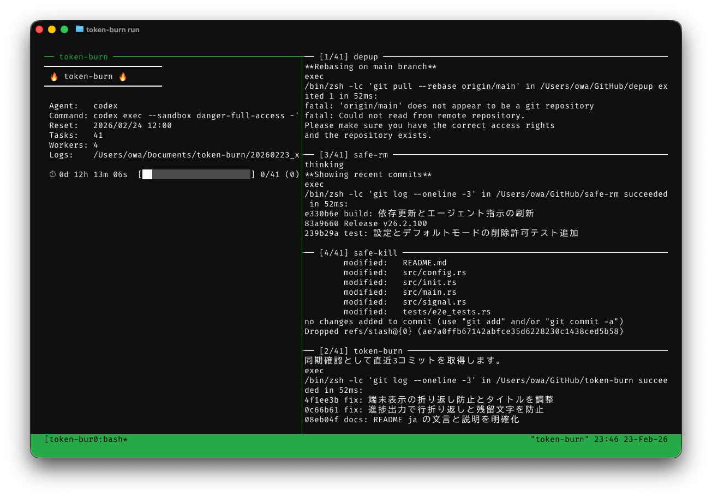
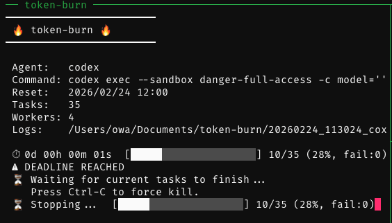

<p align="center">
  
</p>

<h1 align="center">token-burn</h1>

<p align="center">
  <strong>CLI tool to consume AI coding assistant tokens before weekly reset</strong>
</p>

<p align="center">
  <a href="https://github.com/owayo/token-burn/actions/workflows/ci.yml">
    
  </a>
  <a href="https://github.com/owayo/token-burn/releases/latest">
    
  </a>
  <a href="LICENSE">
    
  </a>
</p>

<p align="center">
  English | <a href="README.ja.md">日本語</a>
</p>

---

## Overview

Claude Code / Codex CLI tokens reset weekly with no rollover. Inspired by the Japanese *mottainai* (もったいない) spirit — the belief that waste is something to be avoided — **token-burn** puts those remaining tokens to work. It runs your prompts across repositories in parallel before the reset deadline — code reviews, bug hunts, refactoring, test improvements, or anything else you define. When the reset time arrives, all running processes are automatically terminated.

<p align="center">
  
</p>

<p align="center">
  
</p>

## Features

- **Auto-discovery**: Scans directories for git repos, filters by username in remote URL
- **Multiple scan sources**: Define separate scan configs for GitHub, GitLab, etc.
- **Duplicate-safe scan merge**: If multiple scan sources find the same directory, it is processed only once
- **Visibility-aware**: Prioritizes public repositories over private ones (matched by remote repository name)
- **Multi-agent**: Supports Claude Code, Codex CLI, and custom agents
- **Smart scheduling**: Automatically selects the agent closest to its reset deadline
- **Deadline enforcement**: Kills all child processes when the reset time arrives
- **Parallel execution**: Runs multiple prompts concurrently in tmux split panes with progress monitor
- **Collision-safe logs**: Per-task logs are numbered to avoid overwrite when display names collide
- **Prompt files**: Prompts can be `.md` files or inline strings
- **Resume**: Automatically skips already-processed directories; configurable skip duration
- **Concurrent-safe state**: Parallel workers update `state.json` atomically with file locking
- **Dry run**: Preview execution plan without running commands

## Requirements

- **OS**: macOS
- **tmux**: Required for split-pane execution
- **Rust**: 1.85+ (for building from source)
- **gh CLI**: Required for repository visibility detection
- **Claude Code** and/or **Codex CLI**: At least one agent must be installed

## Installation

### Homebrew (macOS/Linux)

```bash
brew install owayo/token-burn/token-burn
```

### From Source

```bash
git clone https://github.com/owayo/token-burn.git
cd token-burn
make install
```

### From GitHub Releases

Download the latest binary from [Releases](https://github.com/owayo/token-burn/releases).

#### macOS (Apple Silicon)

```bash
curl -L https://github.com/owayo/token-burn/releases/latest/download/token-burn-aarch64-apple-darwin.tar.gz | tar xz
sudo mv token-burn /usr/local/bin/
```

#### macOS (Intel)

```bash
curl -L https://github.com/owayo/token-burn/releases/latest/download/token-burn-x86_64-apple-darwin.tar.gz | tar xz
sudo mv token-burn /usr/local/bin/
```

## Usage

### Quick Start

```bash
# Initialize config file and default prompt
token-burn init

# Check agent reset status
token-burn status

# Preview execution plan
token-burn run -n

# Run only specific repositories
token-burn run ~/GitHub/repo-a ./repo-b

# Run token consumption
token-burn run
```

### Commands

| Command | Description |
|---------|-------------|
| `run` | Execute token consumption (default) |
| `status` | Show agent reset status |
| `init` | Initialize config file and prompt templates |
| `clean` | Clean up old report directories |

### Options

| Option | Short | Description |
|--------|-------|-------------|
| `--config <PATH>` | `-c` | Config file path (default: `~/.config/token-burn/config.toml`) |
| `--agent <NAME>` | | Force specific agent |
| `--dry-run` | `-n` | Preview without executing |
| `--fresh` | | Ignore saved state and process all targets |
| `--limit <N>` | `-l` | Maximum number of targets to process (`N >= 1`) |
| `--no-limit` | | Process all targets without limit |
| `--public-only` | | Process only repositories detected as public |
| `--help` | `-h` | Show help |
| `--version` | `-V` | Show version |

`init` also accepts `--force` (`-f`) to overwrite existing files without confirmation.

`clean` accepts `--older-than` to override the configured `cleanup_after` duration (e.g., `--older-than 3d`).

When you pass one or more `PATH` arguments to `run`, scan discovery and state-based skipping are bypassed for those directories. Equivalent paths such as `repo` and `./repo` are normalized and deduplicated, so the same directory is never executed twice in a single run.

## Configuration

Default config location: `~/.config/token-burn/config.toml`

Run `token-burn init` to generate a config template.

### Settings

```toml
[settings]
parallelism = 3
skip_within = "7d"    # optional
```

| Field | Description | Example |
|-------|-------------|---------|
| `parallelism` | Number of concurrent tasks | `3` |
| `skip_within` | Skip directories processed within this duration | `"7d"`, `"24h"`, `"1d12h"` |
| `cleanup_after` | Auto-delete report directories older than this duration | `"7d"` (default) |
| `report_dir` | Directory to save execution logs | `~/Documents/token-burn` (default) |
| `limit` | Maximum number of targets to process per run (`>= 1`) | `10` (default) |

`skip_within` and `cleanup_after` accept duration strings using `d` (days), `h` (hours), `m` (minutes), and `s` (seconds). Invalid values are rejected when the config file is loaded. If `skip_within` is omitted, directories processed since the previous reset are skipped. Excessively large values are also rejected. Use `--fresh` to ignore saved state entirely.

State is stored in `<config-dir>/state.json` (same directory as the active config file) and updated atomically to avoid lost updates during parallel runs. With the default config path, this is `~/.config/token-burn/state.json`.

### Agents

```toml
[[agents]]
name = "claude"
command = ["claude", "-p", "--dangerously-skip-permissions", "--model", "opus"]
reset_weekday = "monday"
reset_time = "09:00"
timezone = "Asia/Tokyo"
prompt = "prompts/test-coverage.md"  # optional

[[agents]]
name = "codex"
command = ["codex", "exec", "--full-auto", "-c", "model='gpt-5.3-codex'", "-c", "model_reasoning_effort='xhigh'"]
reset_weekday = "thursday"
reset_time = "09:00"
timezone = "Asia/Tokyo"
# prompt = "prompts/codex.md"
```

| Field | Description | Example |
|-------|-------------|---------|
| `name` | Agent identifier | `"claude"` |
| `command` | Command and arguments | `["claude", "-p"]` |
| `reset_weekday` | Reset day of week | `"monday"` |
| `reset_time` | Reset time (HH:MM) | `"09:00"` |
| `timezone` | IANA timezone | `"Asia/Tokyo"` |
| `prompt` | Agent-specific prompt (optional) | `"prompts/test-coverage.md"` |

`name` must not be empty. `command` must contain at least one element, and the first element must be a non-empty executable name. `prompt` overrides the global `[prompts].default` for this agent; target-level `prompt` takes highest priority.

**Prompt priority**: `[[targets]].prompt` > `[[agents]].prompt` > `[prompts].default`

**Claude auto-injected flags**: When the executable is `claude`, the following flags are enforced: `--verbose`, `--output-format stream-json`, `--include-partial-messages`. Missing flags are appended automatically, and an existing `--output-format` value is normalized to `stream-json` (including `--output-format=...` form). These are required for proper log capture and progress monitoring. You do not need to include them in your config.

`reset_weekday` accepts: `monday` `tuesday` `wednesday` `thursday` `friday` `saturday` `sunday` (or short forms: `mon` `tue` `wed` `thu` `fri` `sat` `sun`)

### Auto-scan (multiple sources)

```toml
[[scan]]
base_dirs = ["~/GitHub"]
username = "owayo"
public_first = true
exclude = ["archived-project"]

[[scan]]
base_dirs = ["~/git"]
username = "owayo"
recursive = true
public_first = false
```

| Field | Description | Default |
|-------|-------------|---------|
| `base_dirs` | Directories to scan for git repositories | (required) |
| `username` | Filter repos whose remote URL owner matches this username | (none — all repos included) |
| `public_first` | Sort public repositories before private ones so they are processed first | `true` |
| `recursive` | Recurse into subdirectories to find nested git repositories | `false` |
| `exclude` | Directory names to skip during scan | `[]` |

When `username` is set, visibility lookup uses the repository name parsed from each repository's `origin` remote URL (case-insensitive), so local directory names can differ from remote repository names.

When `username` is not set, repositories are included even if they do not have an `origin` remote. In that case visibility remains `Unknown`.

If multiple `[[scan]]` entries discover the same repository directory, scan results are deduplicated by directory path so the same repository is not executed twice in a single run.

Directory paths are normalized to absolute paths before deduplication and state tracking, so equivalent relative paths such as `repo` and `./repo` are treated as the same target.

The same normalization and deduplication rule also applies when `token-burn run PATH...` is used to force specific directories.

### Prompts

Prompt values ending with `.md` are read as file paths. Relative paths resolve from the config directory.

```toml
[prompts]
default = "prompts/default.md"
```

### Explicit targets (merged with scan results)

```toml
[[targets]]
directory = "~/GitHub/important-project"
prompt = "prompts/test-coverage.md"
```

| Field | Description |
|-------|-------------|
| `directory` | Path to the target directory (required). Must be an existing directory |
| `prompt` | Prompt override for this target. If omitted, `[prompts].default` is used |

If a target's `directory` matches a scan result, the explicit target takes precedence.

## Development

```bash
# Build
make build

# Run tests
make test

# Run clippy and format check
make check

# Build release
make release
```

## License

[MIT](LICENSE)
